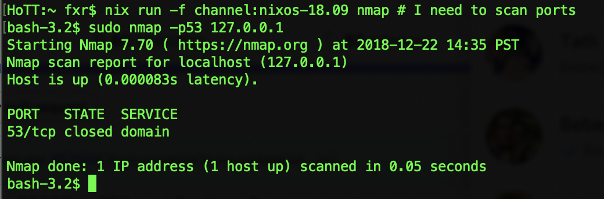
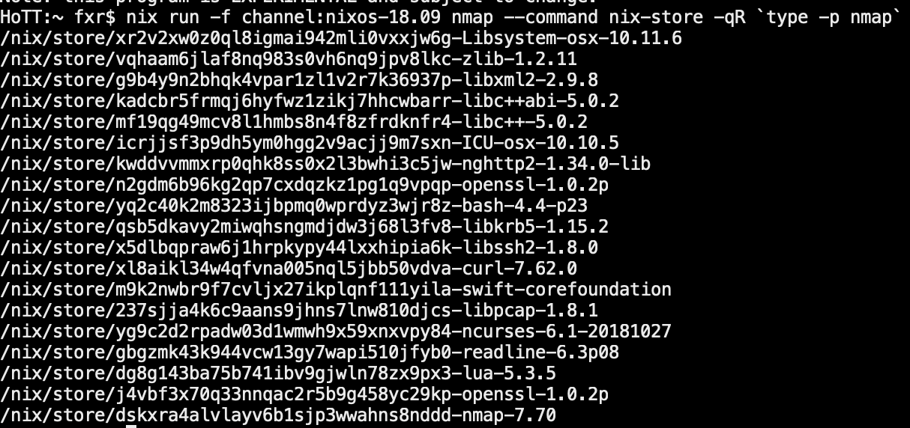
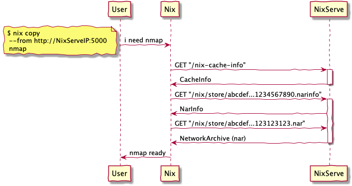

# Quick introduction to Nix Package Manager

Nix is a programming language to express pure and functional packages for Linux
and MacOS. You use it by first installing Nix executable (which is
straightforward) and then ask for packages to be installed to your environment
like this:

There are a lot of packages defined by Nix at [Github Nixpkgs
Repository](https://github.com/NixOS/nixpkgs/tree/release-18.09) and those are
called **Nix Package Collection**.

When you ask for a package (like the example above) Nix first tries to fetch the
signed binary from a binary cache (by default cache.nixos.org) and install it.
If not found, it will build it along with all the dependencies.

Those packages are stored in `/nix/store` (which is read-only). Each package is
stored under a hash.

Nix installs all the dependencies of nmap package to `/nix/store` and we can ask
about them:

# Nix Serve

Now you have entry level knowledge about Nix package manager. It's time to take
a look at what `nix-serve` does for us. 

Because each package is deterministic and given the same rules and files for a
package you'll get exactly the same output wether it's built on the cloud or on
your laptop, we can share those builds once we generate them.

Nix already have support for fetching the output if it's already built and a
binary server is publishing it.

 `nix-serve` does the publishing part straight from your `/nix/store` directory.
Please take a look at the source code at [nix-serve on
github](https://github.com/edolstra/nix-serve/blob/master/nix-serve.psgi). A
simple illustration of how fetching from a binary cache is depicted in
[2](#org4a43410).

`nix-serve` is a daemon process written in Perl Language which serves
`/nix/store` over TCP to clients. When you run `nix-serve`, it listens on port
5000 by default. This daemon is responsible for processing requests made by nix
package manager possibly running on a different machine.

# Challenge

Implement a functioning Nix Serve in Go Language. Provide:

-   An executable named `nix-serve-go`
    -   Use NIXSERVEPORT and NIXSERVESTOREDIR environment variables at
        run-time

-   A systemd service descriptor
    -   Sets NIXSERVEPORT to 5000
    -   Sets NIXSERVESTOREDIR to `/nix/store`
    -   Executes nix-serve-go as a systemd daemon

Discuss how to deploy `nix-serve-go` solution to hundreds of machines in the
cloud, including how to monitor them and upgrade them. Try not to depend on perl
or any other library.

# Acceptance Criteria

Replacing nix-serve with your executable should pass below vm test.

    # Assume that we have a nix package installed on the Server Node. We want to
    # expose our Server's /nix/store as a binary cache via HTTP using nix-serve.
    
    # So we can express this case with two virtual machines with nix.
    
    let
      # pinning to a specific nixpkgs for reproducibility
      pkgsSrc = builtins.fetchTarball https://github.com/NixOS/nixpkgs-channels/archive/9d608a6f592144b5ec0b486c90abb135a4b265eb.tar.gz;
      pkgs = import pkgsSrc {};
    
      # Import VM test infrastructure from pkgs
      makeTest = import (pkgs.path + "/nixos/tests/make-test.nix");
    
      # Our test `binary-cache-test` consists of two machines, one for
      # serving nix derivations, and the other one is for consuming them
      test = {
        name = "binary-cache-test";
    
        nodes = {
          # Server Node has a running service on port 5000 which serves
          # /nix/store as a binary cache using nix-serve program.
          server   = { config, pkgs, lib, ...}: {
            # open required ports
            networking.firewall.allowedTCPPorts = [ 5000 22 ];
    
            # enable nix-serve service
            services.nix-serve.enable = true;
    
          };
    
          client = { config, pkgs, lib, ...}: {
            nix.binaryCaches = lib.mkForce [ "http://server:5000/" ];
            # no special configuration needed except existence of nix
            # package manager
          };
    
        };
    
        testScript = ''
          $server->waitForUnit("nix-serve.service");
          $client->waitForUnit("network.target");
          $server->waitForOpenPort(5000);
    
          # Create a package on Server Node
          $server->succeed("nix-store --add /etc/machine-id > machine-id-path");
          my $mid = $server->succeed("cat machine-id-path");
    
          # ensure a binary cache (port 5000 is the default port for nix-serve)
          # Note that the name "server" resolves to the server's ip
          # address since nix registers all the machines via /etc/hosts
          $client->succeed("${pkgs.curl}/bin/curl -v --fail --connect-timeout 5 http://server:5000/nix-cache-info 2>&1");
    
          # installing myPackage from Server Node should succeed
          $client->succeed("nix copy --no-check-sigs --from http://server:5000/ $mid 2>&1");
        '';
      };
    
    in makeTest test { inherit pkgs; }

